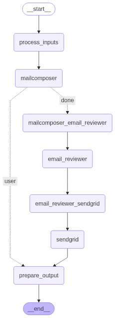
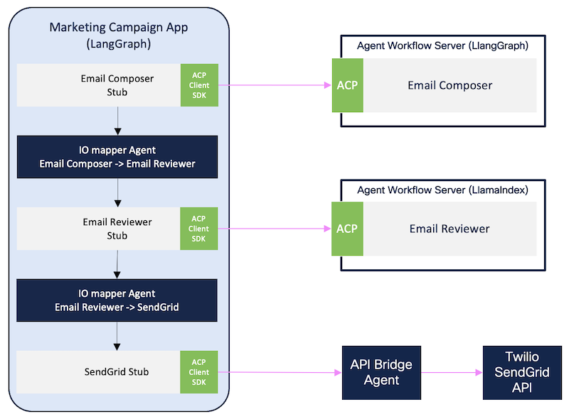

# Marketing Campaign Manager

The **Marketing Campaign Manager** is a demonstration AI application developed with LangGraph. It is meant to provide a working example of a Multi Agent Software that leverages many of the AGNTCY components.

It offers a chat based interface to collect user requirements for an email marketing campaign. Once all requirements are collected, it leverages two remote agents: the [Email Composer Agent](../mailcomposer/) to compose the email, and the [Email Reviewer Agent](../email_reviewer/) to review the composed email and adapt it to the intended audience. Finally, the resulting email is sent to the configured recipient using [Twilio SendGrid](https://www.twilio.com/en-us/sendgrid/email-api) service via its REST API.

The following diagram represents the graph implemented by the marketing campaign manager LangGraph application:



Notable facts are:
* `mailcomposer` is implemented as an ACP Node from the [ACP SDK](https://github.com/agntcy/acp-sdk), which actually invokes a remote instance of the [Email Composer Agent](../mailcomposer/) through ACP.
* `email_reviewer` is also implemented as an ACP Node, which actually invokes a remote instance of the [Email Reviewer Agent](../email_reviewer/).
* `sendgrid` is a regular LangGraph node which invokes an instance of [API Bridge Agent](https://github.com/agntcy/api-bridge-agnt), which in turn invokes the Twilio SendGrid API.
* Between the pairs `mailcomposer`/`email_reviewer` and `email_reviewer`/`sendgrid`, an [IO Mapper Agent](https://github.com/agntcy/iomapper-agnt) node is used to make sure that output of each node is adapted to serve as input of the following node.

The following diagram represents a simplified architecture of the app including remote agents and APIs:



## Prerequisites

Before running the application, ensure the following requirements are satisfied:

- [Python 3.9 or higher](https://www.python.org/downloads/)
- [Poetry](https://python-poetry.org/docs/#installation)
- [Golang](https://go.dev/doc/install)
- [Make](https://cmake.org/)
- [Git](https://git-scm.com/)
- [Git LFS](https://git-lfs.com/)
- [Docker with Buildx](https://docs.docker.com/get-started/get-docker/)
- [Docker Compose](https://docs.docker.com/compose/)
- [Azure OpenAI API Key](https://learn.microsoft.com/en-us/azure/cognitive-services/openai/quickstart)


## Setup Instructions

### 1. Run the API Bridge Agent and Connect it to SendGrid

Clone the [API Bridge Agent repo](https://github.com/agntcy/api-bridge-agnt), navigate to the repo and run the following commands:

```sh
export OPENAI_API_KEY=***YOUR_OPENAI_API_KEY***

# Optionally, if you want to use Azure OpenAI, you also need to specify the endpoint with the OPENAI_ENDPOINT environment variable:
export OPENAI_ENDPOINT="https://YOUR-PROJECT.openai.azure.com"

make start_redis
make start_tyk
```

In a different shell, configure the API Bridge Agent with SendGrid API:

```sh
curl http://localhost:8080/tyk/apis/oas \
  --header "x-tyk-authorization: foo" \
  --header 'Content-Type: text/plain' \
  -d@configs/api.sendgrid.com.oas.json

curl http://localhost:8080/tyk/reload/group \
  --header "x-tyk-authorization: foo"
```

### 2. Download the Agent Workflow Server Manager

Follow these [instructions](https://docs.agntcy.org/pages/agws/workflow_server_manager.html#installation) to install the Agent Workflow Server Manager.

At the end of the installation you should be able to run the `wsfm` command:

```sh
 $ wfsm --version
wfsm version v0.2.0
```

### 3. Install Python dependencies
   From the `marketing-campaign` folder:

   ```sh
   poetry install
   ```

## Running the Marketing Campaign Manager

The Marketing Campaign Manager application can be run in two ways:
1. Using the [Agent Workflow Server Manager](https://github.com/agntcy/workflow-srv-mgr) to start the whole app, including remote agents, and expose it through ACP. In this case, the interaction with the application happens through ACP via an [ACP client](./marketing-campaign/main_acp_client.py)
2. Using [Agent Workflow Server Manager](https://github.com/agntcy/workflow-srv-mgr) to start only the remote agents, while the app is started and invoked directly through a [Python script](./marketing-campaign/main_langgraph.py). 


### Method 1: Marketing Campaign Manager as ACP Server

This method demonstrates how to start the application, and its dependencies (the remote agents) through the Agent Workflow Server Manager by using the [app manifest](./deploy/marketing-campaign.json) and then invoke it through ACP.

#### Steps:

1. **Configure the Agents**:
   Before starting the workflow server, provide the necessary configurations for the agents. Open the `./deploy/marketing_campaign_example.yaml` file located in the `deploy` folder and update the environment variables with your values. 

   ```yaml
    config:
        email_reviewer:
            port: 0
            apiKey: 799cccc7-49e4-420a-b0a8-e4de949ae673
            id: 45fb3f84-c0d7-41fb-bae3-363ca8f8092a
            envVars:
              AZURE_OPENAI_API_KEY: [YOUR AZURE OPEN API KEY]
              AZURE_OPENAI_ENDPOINT: https://[YOUR ENDPOINT].openai.azure.com
        mailcomposer:
            port: 0
            apiKey: a9ee3d6a-6950-4252-b2f0-ad70ce57d603
            id: 76363e34-d684-4cab-b2b7-2721c772e42f
            envVars:
              AZURE_OPENAI_API_KEY: [YOUR AZURE OPEN API KEY]
              AZURE_OPENAI_ENDPOINT: https://[YOUR ENDPOINT].openai.azure.com
        org.agntcy.marketing-campaign:
            port: 65222
            apiKey: 12737451-d333-41c2-b3dd-12f15fa59b38
            id: d6306461-ea6c-432f-b6a6-c4feaa81c19b
            envVars:
              AZURE_OPENAI_API_KEY: [YOUR AZURE OPEN API KEY]
              AZURE_OPENAI_ENDPOINT: https://[YOUR ENDPOINT].openai.azure.com
              SENDGRID_HOST: http://host.docker.internal:8080
              SENDGRID_API_KEY: [YOUR SENDGRID_API_KEY]
   ```

    Note that `apiKey` and `id` can be edited as well or removed. In the latter case, they are generated automatically by the workflow server manager. Within the scope of this guide, for simiplicity, **we recommend not to modify them**.

2. **Start the Workflow Server**:
   Run the following command to deploy the Marketing Campaign workflow server:
   ```sh
   wfsm deploy -m ./deploy/marketing-campaign.json -c ./deploy/marketing_campaign_example.yaml --dryRun=false
   ```

  If everything goes well, last lines of the log should look similar to the following
  ```sh
    email_reviewer-1                 | 2025-05-09T14:23:26.006785000+02:00INFO:     agent_workflow_server.agents.load Loaded Agent from /opt/agent-workflow-server/.venv/lib/python3.12/site-packages/email_reviewer/__init__.py 
    email_reviewer-1                 | 2025-05-09T14:23:26.006798000+02:00INFO:     agent_workflow_server.agents.load Agent Type: LlamaIndexAgent 
    email_reviewer-1                 | 2025-05-09T14:23:26.006813000+02:00INFO:     agent_workflow_server.agents.load Registered Agent: '45fb3f84-c0d7-41fb-bae3-363ca8f8092a' 
    email_reviewer-1                 | 2025-05-09T14:23:26.006825000+02:00INFO:     agent_workflow_server.services.queue Starting 5 workers 
    org.agntcy.marketing-campaign-1  | 2025-05-09T14:23:26.006763000+02:00INFO:     Application startup complete.
    org.agntcy.marketing-campaign-1  | 2025-05-09T14:23:26.006846000+02:00INFO:     Uvicorn running on http://0.0.0.0:8000 (Press CTRL+C to quit)
    email_reviewer-1                 | 2025-05-09T14:23:26.006832000+02:00INFO:     Started server process [7]
    email_reviewer-1                 | 2025-05-09T14:23:26.006862000+02:00INFO:     Waiting for application startup.
    email_reviewer-1                 | 2025-05-09T14:23:26.006868000+02:00INFO:     Application startup complete.
    email_reviewer-1                 | 2025-05-09T14:23:26.006874000+02:00INFO:     Uvicorn running on http://0.0.0.0:8000 (Press CTRL+C to quit)
    email_reviewer-1                 | 2025-05-09T14:23:26.006879000+02:00INFO:     agent_workflow_server.agents.load Loaded Agent Manifest from /opt/spec/manifest.json 
    email_reviewer-1                 | 2025-05-09T14:23:26.006885000+02:00INFO:     agent_workflow_server.agents.load Loaded Agent from /opt/agent-workflow-server/.venv/lib/python3.12/site-packages/email_reviewer/__init__.py 
    email_reviewer-1                 | 2025-05-09T14:23:26.006890000+02:00INFO:     agent_workflow_server.agents.load Agent Type: LlamaIndexAgent 
    email_reviewer-1                 | 2025-05-09T14:23:26.006895000+02:00INFO:     agent_workflow_server.agents.load Registered Agent: '45fb3f84-c0d7-41fb-bae3-363ca8f8092a' 
    email_reviewer-1                 | 2025-05-09T14:23:26.006900000+02:00INFO:     agent_workflow_server.services.queue Starting 5 workers 
    email_reviewer-1                 | 2025-05-09T14:23:26.006906000+02:00INFO:     Started server process [7]
    email_reviewer-1                 | 2025-05-09T14:23:26.006921000+02:00INFO:     Waiting for application startup.
    email_reviewer-1                 | 2025-05-09T14:23:26.006931000+02:00INFO:     Application startup complete.
    email_reviewer-1                 | 2025-05-09T14:23:26.006938000+02:00INFO:     Uvicorn running on http://0.0.0.0:8000 (Press CTRL+C to quit)
  ```

3. **Export Environment Variables**:
   In a different shell, export the environment variables describing how to interact with the app. Note that these values correspond to those provided as configuration above.
   ```sh
   export MARKETING_CAMPAIGN_HOST="http://localhost:65222"
   export MARKETING_CAMPAIGN_ID="d6306461-ea6c-432f-b6a6-c4feaa81c19b"
   export MARKETING_CAMPAIGN_API_KEY='{"x-api-key": "12737451-d333-41c2-b3dd-12f15fa59b38"}'
   ```
   Export environment variables specific to the marketing campaign manager app.
  
   ```sh
   export RECIPIENT_EMAIL_ADDRESS="recipient@example.com"
   export SENDER_EMAIL_ADDRESS="sender@example.com" # Sender email address as configured in SendGrid
   ```

4. **Run the Application**:

   #### Start the Marketing Campaign Manager application using the ACP client and send prompts via CLI: ###
   ```sh
   poetry run python src/marketing_campaign/main_acp_client.py
   ```
   #### Start the Marketing Campaign Manager application and send prompts via a UI: ####
   ```sh
   poetry run ui
   ```

   Interact with the application to compose and review emails. Once approved, the email will be sent to the recipient via SendGrid.
   
   ```sh
   Write me an email about AI marketing, be creative
   ```


### Method 2: Marketing Campaign Manager as Python script 

This method provides an alternative way to start and invoke the Marketing Campaign application by directly invoking the **LangGraph graph** of the Marketing Campaign through a Python script. 

This method requires to start the remote agents independently and is primarily intended for development and debugging purposes, allowing developers to test and refine the LangGraph logic.

#### Steps:

1. **Start Workflow Servers for Dependencies**:
   Manually start the workflow servers for the **MailComposer** and **EmailReviewer** agents in separate terminals. Before doing that, edit `../mailcomposer/deploy/mailcomposer_example.yaml` and `../email_reviewer/deploy/email_reviewer_example.yaml` with your configuration.

   ```sh
   wfsm deploy -m ../mailcomposer/deploy/mailcomposer.json -c ../mailcomposer/deploy/mailcomposer_example.yaml --dryRun=false
   ```
   ```sh
   wfsm deploy -m ../email_reviewer/deploy/email_reviewer.json -c ../email_reviewer/deploy/email_reviewer_example.yaml  --dryRun=false
   ```

   In a different shell, export the environment variables describing how to interact with the mailcomposer and email reviewer. Note that these values correspond to those provided as configuration above.

   ```sh
   export MAILCOMPOSER_HOST="http://localhost:52384"
   export MAILCOMPOSER_ID="76363e34-d684-4cab-b2b7-2721c772e42f"
   export MAILCOMPOSER_API_KEY='{"x-api-key": "a9ee3d6a-6950-4252-b2f0-ad70ce57d603"}'
   export EMAIL_REVIEWER_HOST="http://localhost:52393"
   export EMAIL_REVIEWER_ID="45fb3f84-c0d7-41fb-bae3-363ca8f8092a"
   export EMAIL_REVIEWER_API_KEY='{"x-api-key": "799cccc7-49e4-420a-b0a8-e4de949ae673"}'
   ```

2. **Export Additional Environment Variables**:
   Set the following environment variables:
   ```sh
   export API_HOST=0.0.0.0
   export SENDGRID_HOST=http://localhost:8080
   export SENDGRID_API_KEY=SG.your_secret
   export AZURE_OPENAI_API_KEY=your_secret
   export AZURE_OPENAI_ENDPOINT='https://[YOUR ENDPOINT].openai.azure.com'
   export RECIPIENT_EMAIL_ADDRESS="recipient@example.com"
   export SENDER_EMAIL_ADDRESS="sender@example.com" # Sender email address as configured in Sendgrid
   ```

3. **Run the Application**:
   Start the Marketing Campaign Manager application using the Python script:
   ```sh
   poetry run python src/marketing_campaign/main_langgraph.py
   ```

   Interact with the application to compose and review emails. Once approved, the email will be sent to the recipient via SendGrid.


