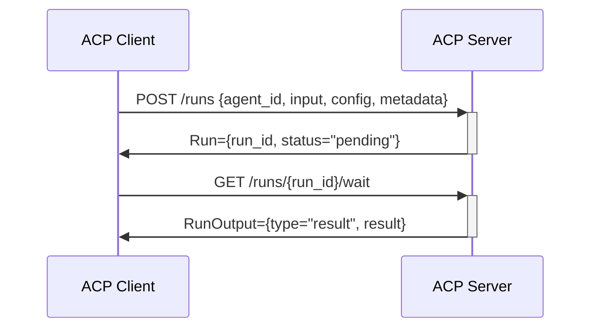
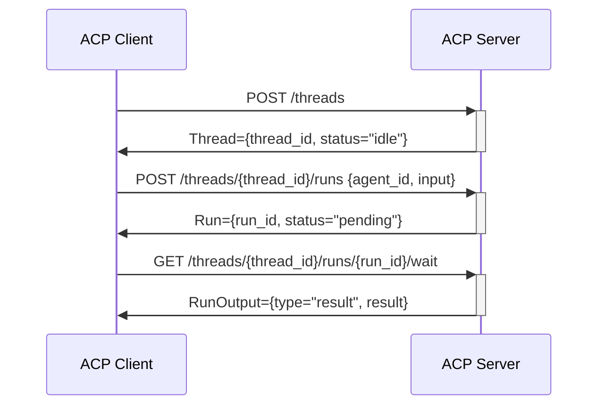
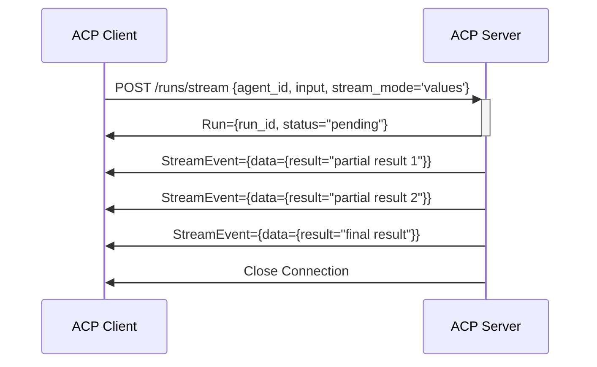

# Agent Connect Protocol (ACP) with Simple Agent Framework

Welcome to the Agent Connect Protocol (ACP) tutorial series using Galileo's Simple Agent Framework. This repository provides step-by-step tutorials, examples, and resources to help you understand and implement the Agent Connect Protocol for creating powerful, distributed AI agent applications.

## What is Agent Connect Protocol (ACP)?

The [Agent Connect Protocol (ACP)](https://github.com/agntcy/acp-spec/) is an open specification that defines a standard interface to invoke and configure agents. It enables seamless integration between different agent systems by providing a common language for agent communication.

ACP provides standardized patterns for:

- Defining and discovering agent capabilities
- Invoking agents with standardized request formats
- Supporting various execution modes (sync, async, streaming)
- Configuring remote agents with consistent parameters
- Handling responses and errors with uniform formats
- Enabling cross-framework agent interoperability

This specification is developed with the support of the Internet of Agents (IoA) community, with the goal of facilitating cross-framework agent interoperability, allowing agents built with different frameworks to communicate seamlessly.

## ACP Technical Overview

The ACP specification defines a comprehensive set of APIs and patterns for agent interactions:

### Agent Discovery and Descriptors

Agents expose their capabilities through **Agent ACP Descriptors**, which contain:

- **Metadata**: Unique identifiers, version information, and descriptions
- **Capabilities**: Supported features (threads, interrupts, callbacks, streaming)
- **Schema Definitions**: JSON schemas for inputs, outputs, configuration, and thread states

Clients can retrieve agent information through:
- `POST /agents/search` - Find agents by name, version, or other criteria
- `GET /agents/{agent_id}/descriptor` - Retrieve the full descriptor for a specific agent

### Agent Interaction Patterns

ACP supports several key interaction patterns:

1. **Runs**: Single agent executions
   - Start runs with `POST /runs`
   - Poll for completion with `GET /runs/{run_id}`
   - Wait for completion with `GET /runs/{run_id}/wait`

2. **Streaming**: Real-time partial results
   - Receive incremental updates via Server-Sent Events
   - Support for both "values" mode (complete results) and "custom" streaming

3. **Threads**: Conversational state management
   - Create threads with `POST /threads`
   - Start runs on threads with `POST /threads/{thread_id}/runs`
   - Access thread history with `GET /threads/{thread_id}`

4. **Interrupts**: Agent-initiated interactions
   - Receive requests for additional input from agents
   - Provide needed information to resume processing

5. **Callbacks**: Asynchronous notifications
   - Register callbacks to be notified of run status changes

## Getting Started

This repository is organized into tutorial modules that build on each other, starting from the basics and progressing to more advanced agent implementations:

1. [Tutorial Overview](tutorials/00-overview.md) - Start here for an introduction to the series
2. [Introduction to ACP with Simple Agent Framework](tutorials/01-intro-to-agp.md) - Understanding the foundation
3. [Building Your First ACP Client](tutorials/02-first-agp-client.md) - Creating a client agent
4. [Implementing ACP Server Agents](tutorials/03-agp-server.md) - Building server-side agents
5. [Implementation Summary](tutorials/implementation-summary.md) - How it all fits together
6. [AGP Architecture Visualization](tutorials/agp-architecture.md) - Visual diagrams of the architecture

**Coming Soon:**
- Advanced ACP Patterns - Implementing threads, interrupts, streaming
- Working with Agent ACP Descriptors - Creating and consuming descriptors
- Building Multi-Agent Systems - Coordinating agents through ACP
- Deploying ACP Applications - Production deployment strategies

## The Simple Agent Framework

This tutorial series is built around the [Simple Agent Framework](https://github.com/rungalileo/simple-agent-framework) from Galileo, which provides a flexible foundation for building AI agents with:

- Tool-based capabilities
- State management
- Prompt templating
- Advanced logging
- Configuration management

We extend this framework to implement the Agent Connect Protocol, enabling distributed agent communication across different systems and environments.

## Example Applications

The repository includes complete, working examples that demonstrate ACP in action:

- [Remote Agent](remote_agent_agp/README.md) - A template for building remote agent applications
TODO:
- [Thread-Based Chat](thread_chat_demo) - Demonstrates thread state management (Coming soon!)
TODO:
- [Streaming Agent](streaming_demo) - Shows real-time streaming capabilities (Coming soon!)
TODO:
- [Interrupt-Based Workflow](interrupt_workflow) - Demonstrates interactive agent interrupts (Coming soon!)

## ACP Implementation Patterns

Throughout these tutorials, we'll demonstrate several key patterns for implementing ACP:

TODO: highlight where these need to be done

1. **Agent ACP Descriptor Implementation**
   - Creating schema definitions for agent capabilities
   - Registering and exposing agent descriptors

2. **Run Management**
   - Starting and tracking agent runs
   - Processing inputs and outputs according to ACP standards

3. **Thread State Handling**
   - Creating and managing conversational state
   - Persisting and retrieving thread history

4. **Streaming Implementation**
   - Implementing real-time output streaming
   - Processing streaming responses on the client side

5. **Interrupt Handling**
   - Creating agents that request additional input
   - Handling and responding to agent interrupts

## Prerequisites

To work through these tutorials, you'll need:

- Python 3.12+
- Basic understanding of REST APIs and asynchronous programming
- OpenAI API key (or other LLM provider)
- Docker (for containerized deployments)

## Quick Start

1. Clone this repository:
   ```
   git clone https://github.com/agntcy/agentic-apps
   cd agentic-apps
   ```

2. Install the Simple Agent Framework and other dependencies:
   ```
   pip install git+https://github.com/rungalileo/simple-agent-framework.git
   pip install -r requirements.txt
   ```

3. Set up your environment variables:
   ```
   cp .env.example .env
   # Edit .env with your API keys
   ```

4. Start with the tutorial overview:
   ```
   open tutorials/00-overview.md
   ```

## Repository Structure

```
acp-tutorials/
├── tutorials/                # Tutorial markdown files
│   ├── 00-overview.md        # Overview of the tutorial series
│   ├── 01-intro-to-agp.md    # Introduction to ACP with Simple Agent Framework
│   ├── 02-first-agp-client.md # Building your first ACP client
│   ├── 03-agp-server.md      # Implementing server-side agents
│   ├── implementation-summary.md # How all the pieces fit together
│   └── agp-architecture.md   # Architectural visualizations
├── remote_agent_agp/         # Complete example of a remote agent
├── requirements.txt          # Project dependencies
└── .env.example              # Example environment variables
```

## Key Concepts

The tutorial series covers these key concepts:

1. **Simple Agent Framework Fundamentals** - The building blocks for agent development
2. **Agent Connect Protocol Standards** - How agents communicate using standardized formats
3. **Tool-Based Communication** - Implementing ACP as tools within agents
4. **Client-Gateway-Server Pattern** - Architecture for distributed agent systems
5. **State Management** - Maintaining context across agent interactions
6. **Error Handling** - Managing failures in distributed environments

## API Flows Covered in Tutorials

Our tutorials will guide you through implementing these key ACP API flows:

### Basic Agent Runs


### Thread-Based Conversations


### Output Streaming


## Community Resources

- [Simple Agent Framework](https://github.com/rungalileo/simple-agent-framework)
- [Agent Connect Protocol Specification](https://github.com/agntcy/acp-spec/) - Official ACP specification repository
- [ACP Documentation](https://docs.agntcy.org) - Comprehensive documentation on Agent Connect Protocol
- [IoA Documentation](https://docs.agntcy.org) - Information on the Internet of Agents ecosystem
- [Agent Control SDK](https://agntcy.github.io/acp-sdk) - Tools for working with ACP and Agent ACP Descriptors
- [OpenAPI Visualization](https://agntcy.github.io/acp-spec/docs/openapi.html) - Browse the API specification

## Roadmap

The Agent Connect Protocol specification is actively evolving with these upcoming features:

- Support for streaming responses
- Support for pre-configured agents
- Support for agent invocation by name and version

These features will be incorporated into future tutorials as they become available in the specification.

## Contributing

We welcome contributions to improve these tutorials! Please read [CONTRIBUTING.md](CONTRIBUTING.md) for guidelines on how to submit improvements.

## Other IoA Agentic Apps

A list of IoA Agentic Apps in other Github repositores :

- Terraform Code Analzyer : [tf-code-analyzer-agntcy-agent](https://github.com/cisco-outshift-ai-agents/tf-code-analyzer-agntcy-agent)
- Terraform Code Reviewer: [tf-code-reviewer-agntcy-agent](https://github.com/cisco-outshift-ai-agents/tf-code-reviewer-agntcy-agent)

## Copyright Notice

[Copyright Notice and License](./LICENSE.md)

Distributed under Apache 2.0 License. See LICENSE for more information.

Copyright AGNTCY Contributors (https://github.com/agntcy)
